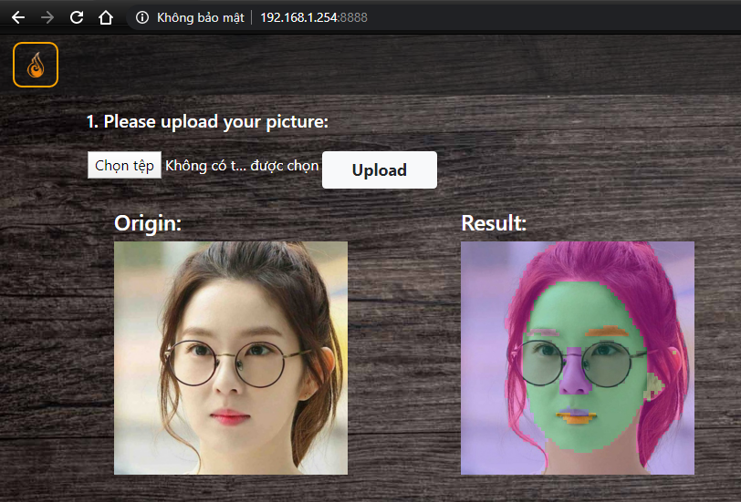

# Face parser project
> Face parser model using BiSeNet. Re-implement in Tensorflow 2.1 base on previous work of [zllrunning - PyTorch](https://github.com/zllrunning/face-parsing.PyTorch)



## Usage
- Environment
   - Python 3.6
   - TensorFlow 2.1.0
   - Django

   - *We recommend [Anaconda](https://www.anaconda.com/distribution/#download-section) or [Miniconda](https://docs.conda.io/en/latest/miniconda.html#linux-installers), then you can create the environment with commands below*
     ```console
     conda create -n tf2 python=3.6
     conda activate tf2
     pip install --upgrade pip
     pip install tensorflow==2.1.0
     pip install django
     pip install dlib
     pip install opencv-python
     pip install pillow
     pip install requests matplotlib
     
     ```

- Run web application
   *All commands are run from face_parser directory after "git clone"*
   - Download pre-trained models
      - pretrained_weights.zip (move to **face_parser/pretrained_weights.zip**): [Google Drive](https://drive.google.com/open?id=1S9SgG2KV_uaYTY3kEBzyKHT7WL4Df83u)
   - Unzip the models
      ```console
      unzip ./pretrained_weights.zip
      ```
   - Run web application
      ```console
      cd web_app
      ./runserver.sh
      ```
   - Open web browser. Go to http://127.0.0.1:8000/. After the web page is loaded, you can try your own sample. If you would like to run web server on specific IP and port, you can pass it as arguments.
      ```console
      e.g.
      ./runserver.sh 192.168.1.254:8888
      ```


